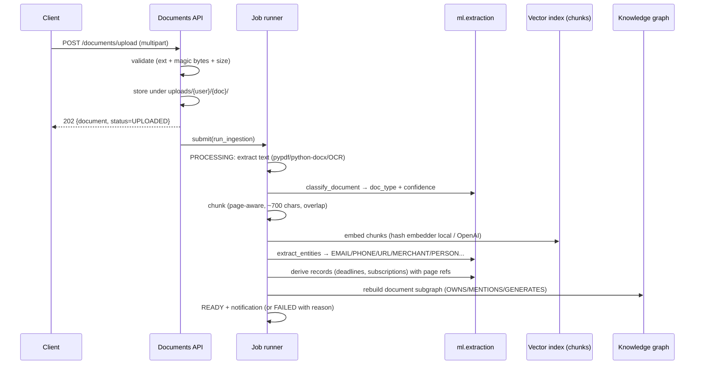
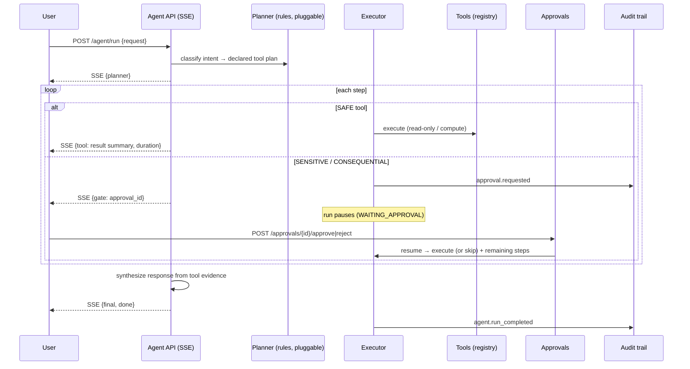

# NEXUS — Architecture

> Personal Life Intelligence & Action OS.
> Design principle: **observe → understand → retrieve evidence → analyze →
> predict → explain → propose → ask permission → act safely.**

## 1. System overview

```mermaid
flowchart LR
  subgraph Browser
    WEB[NEXUS Web<br/>React 18 + TS + Tailwind]
  end

  subgraph API["FastAPI service (apps/api)"]
    AUTH[Auth: JWT + PBKDF2<br/>rate-limited]
    DOCS[Documents API]
    SEARCH[Search / Ask<br/>hybrid RAG]
    AGENT[Agent API<br/>SSE stream]
    APPR[Approvals API]
    ANA[Analytics / Eval]
    CORE[core: config, errors, security]
  end

  subgraph Jobs["In-process job runner (thread pool)"]
    INGEST[Ingestion pipeline]
    EVALJ[Eval runs]
  end

  subgraph ML["ml/ package (pure, framework-free)"]
    EXT[extraction: dates/amounts/entities/classify]
    REC[recurring detection]
    ANOM[anomaly: IsolationForest]
    FCST[forecasting: trend+seasonal]
    RISK[risk: rules + Naive Bayes]
    EVM[evaluation: dataset + metrics]
  end

  DB[(SQLite local /<br/>Postgres + pgvector prod)]
  FILES[(uploads dir /<br/>S3 in prod)]

  WEB -- "/api/v1 (JSON + SSE)" --> AUTH & DOCS & SEARCH & AGENT & APPR & ANA
  DOCS --> FILES
  DOCS -- "submit job" --> INGEST
  INGEST --> EXT
  INGEST --> DB
  INGEST --> FILES
  SEARCH --> ML_EMBED
  ML_EMBED[embeddings: hash local /<br/>OpenAI (config-gated)]
  AGENT --> TOOLS[tools registry<br/>SAFE/SENSITIVE/CONSEQUENTIAL]
  TOOLS --> REC & ANOM & FCST & RISK & EVM
  TOOLS --> DB
  APPR --> AGENT
  ANA --> EVM
  DB --> WEB
```

## 2. Monorepo layout

```
nexus/
├── apps/
│   ├── api/                  # FastAPI service
│   │   ├── app/
│   │   │   ├── api/          # routers (auth, documents, search, insights,
│   │   │   │                 #  risk, agents, approvals, analytics, notifications)
│   │   │   ├── agents/       # planner, tools, executor, policies, memory
│   │   │   ├── audit/        # append-only audit trail
│   │   │   ├── core/         # config, security, errors
│   │   │   ├── db/           # models (16 tables), session, base
│   │   │   ├── llm/          # provider abstraction (mock/openai/anthropic/gemini)
│   │   │   ├── rag/          # hybrid retriever, context builder, grounded answers
│   │   │   ├── schemas/      # Pydantic v2 API contracts
│   │   │   ├── services/     # storage, extraction, chunking, ingest, records,
│   │   │   │                 #  transactions, graph, notifications, eval service
│   │   │   └── tasks/        # in-process threaded job runner
│   │   └── tests/            # API + DS + agent tests (34 tests)
│   ├── web/                  # React frontend (apps/web)
│   └── worker/               # reserved: standalone job runner wrapper
├── ml/                       # data-science package (no web deps)
│   ├── embeddings/ extraction/ recurring/ anomaly/
│   ├── forecasting/ risk/ evaluation/
├── data/demo/                # committed synthetic dataset (no real PII)
├── data/processed/           # runtime (gitignored): sqlite db + uploads
├── scripts/                  # generate_demo_data.py, seed_demo.py
├── tests/                    # end-to-end scenario tests
├── docs/                     # this documentation
└── infrastructure/           # docker + aws/terraform
```

## 3. Ingestion pipeline



Statuses: `UPLOADED → PROCESSING → INDEXING → READY | FAILED`.
Failures are user-visible with actionable reasons (e.g. scanned PDF without
OCR), never silent.

## 4. Retrieval (hybrid RAG)

- **Vector**: cosine over L2-normalised embeddings.
  Local default = deterministic hashing embedder (384-d) so the whole
  pipeline runs offline; `NEXUS_EMBED_PROVIDER=openai` swaps the provider
  without touching the retriever contract.
- **Lexical**: BM25 (k1=1.5, b=0.75) over the same candidate window.
- **Blend**: `0.6·vector + 0.4·bm25` (normalised).
- **Metadata filter**: `doc_type` and, always, `user_id` (tenant isolation).
- **Citations**: every answer returns sources with document, page, chunk
  index and similarity. Refusals return **no** sources.
- **pgvector path**: when Postgres is configured and
  `NEXUS_USE_PGVECTOR=1`, search runs in SQL with the `<=>` operator and
  re-blends BM25 over the top-k window (see `rag/retriever.py`).

## 5. Action pipeline (agents)



## 6. Storage

Local (default): SQLite + local upload directory. Production: Postgres 16
with pgvector (schema is portable: UUID-string PKs, JSON columns only for
genuinely semi-structured payloads), S3 for raw files, Redis for
cross-instance rate limiting, SQS for jobs. All are config-driven seams
(see `core/config.py`), not code forks.

Key tables (16): users, documents, document_chunks, document_entities,
merchants, transactions, subscriptions, deadlines, risks, tasks,
agent_runs, agent_steps, approvals, audit_events, model_predictions,
knowledge_entities/relationships, rag_eval_results, notifications,
memory_entries.

## 7. Honest capability boundaries

| Capability | Local mode | With credentials |
|---|---|---|
| LLM text generation | **mock**: deterministic extractive/templated answers (declared) | OpenAI / Anthropic / Gemini |
| Embeddings | deterministic hash embedder (lexical) | OpenAI (semantic) |
| Agent planning | deterministic rule planner (documented, pluggable) | LLM planner behind same interface |
| send_email / cancel_subscription | **simulation stubs** — approved runs return an explicit `SIMULATED` result with the reason | real provider integrations |
| OCR for images | attempted when `pytesseract` is installed; otherwise explicit FAILED | — |

Nothing in local mode pretends to be a live LLM or performs external-world
actions.
